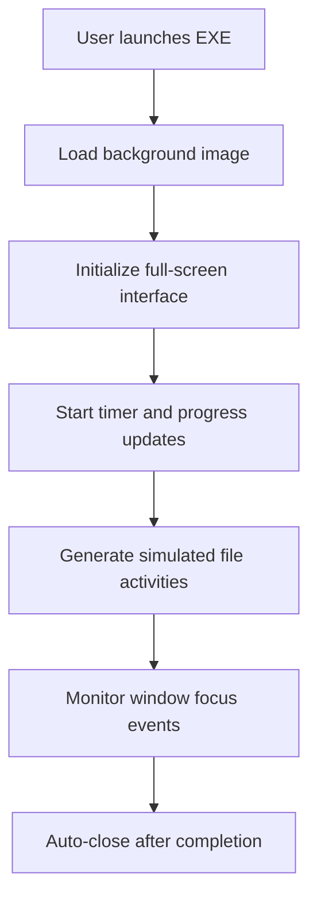

# Incident Impact Visualizer

[](https://www.python.org/)
[](https://opensource.org/licenses/MIT)

A desktop-based cybersecurity awareness tool developed using Python and Tkinter, designed to demonstrate the visual and psychological impact of a large-scale cyber incident in a safe and controlled environment.

The application presents a full-screen simulation featuring a realistic warning interface, progress indicators, activity logs, and dynamic visual elements that mimic how users perceive a disruptive security event.

> [!IMPORTANT]  
> **Safety Notice:** This simulator does **NOT** encrypt, modify, rename, delete, or access any real user files. It is purely an educational and demonstration tool designed with safe principles.

---

## 🎯 Objectives
- **Demonstrate** how disruptive cyber incidents affect end users.
- **Increase user awareness** through immersive simulations.
- **Provide a realistic environment** for security awareness training sessions.
- **Support** presentations, hackathons, and cybersecurity training exercises.
- **Illustrate** the critical importance of cyber hygiene and prompt incident reporting.

---

## 🚀 Features

### 🖥️ Full-Screen Experience
- Launches in an immersive, full-screen mode.
- Stays positioned above other application windows.
- Automatically exits after the configured duration (default: 120 seconds).

### 🖼️ Dynamic Background
- Supports customizable, dramatic background images (PNG/JPG) to enhance realism.

### 📊 Visual Progress Indicator
- Displays a continuously updating progress bar representing simulated processing activity.

### 📜 Simulated File Activity
- Generates realistic-looking file operations using randomly selected fake filenames (e.g., `Scanning Payroll.xlsx`, `Processing Contracts.pdf`). **No real files are ever accessed.**

### ⏱️ Countdown Timer
- Provides a fixed-duration experience with a countdown timer showing the remaining simulation time.

### 👁️ Focus Monitoring
- Tracks when users switch focus away from the simulator and when they return, which is useful for generating focus-retention metrics:
  ```
  [INFO] User switched away from simulator
  [INFO] User returned to simulator
  ```

---

## 🛡️ Safe Design Principles

The simulator is intentionally designed to be non-destructive. **It does NOT:**
- Encrypt, rename, or delete any files.
- Modify registry settings or system configurations.
- Establish any form of persistence.
- Disable Task Manager or key system shortcuts (like `Ctrl+Alt+Delete`).
- Communicate over the network (fully offline).

---

## 💻 Technology Stack

| Component | Technology |
| :--- | :--- |
| **Programming Language** | Python 3 |
| **GUI Framework** | Tkinter |
| **Image Processing** | Pillow (PIL) |
| **Packaging** | PyInstaller |
| **Platform** | Windows |

---

## 🛠️ Project Architecture



---

## 📦 Installation & Setup

### 1. Clone the Repository
```bash
git clone https://github.com/n-ancy/Ransomware-Awareness-Simulator.git
cd Ransomware-Awareness-Simulator
```

### 2. Install Dependencies
Ensure you have Python 3 installed, then install the required library:
```bash
pip install pillow
```

### 3. Run the Application
```bash
python main.py
```

---

## 🖥️ Building the Standalone Executable

To compile the application into a single executable that includes the background image:

```bash
py -m PyInstaller --onefile --noconsole --add-data "background.png;." main.py
```

Once completed, the standalone executable will be located in the `dist/` directory.

---

## 📂 Project Structure

```text
Incident-Impact-Visualizer/
├── main.py                # Main Tkinter application code
├── background.png         # Simulation background image
├── requirements.txt       # Python dependencies
├── README.md              # Project documentation
└── dist/                  # Output directory for the packaged EXE (Git ignored)
```

---

## 🏫 Use Cases & Future Enhancements

### Use Cases
- **Security Awareness Programs:** Demonstrate the disruption caused by cyber incidents to staff.
- **University Demonstrations:** Perfect for cybersecurity projects and academic showcases.
- **Hackathons:** Serve as a foundation that can be extended with external visualizations.
- **Workshops:** Interactive training sessions for employees and students.

### Future Enhancements
- Multi-screen support.
- SOC / SIEM dashboard integration.
- Training analytics and feedback collection.
- Custom scenario scoring mechanisms.

---

## 💬 Interview Quick-Pitch

If you are presenting this project in an interview, here is a concise way to explain it:

> *"I developed a desktop-based cyber incident awareness simulator using Python and Tkinter. The objective was to create an immersive environment that demonstrates the perceived impact of a disruptive security event without affecting the underlying system. The simulator uses dynamic visual elements, simulated activity logs, progress indicators, and customizable backgrounds to support awareness sessions, presentations, and cybersecurity demonstrations while adhering to safe-design principles."*

---

## 📄 License
This project is licensed under the MIT License - see the LICENSE file for details.
